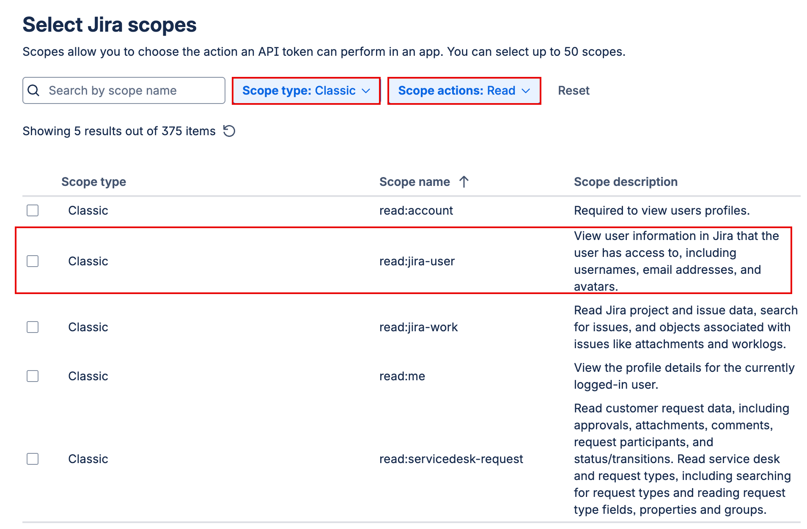

# Start using Allure3 plugin for Jira Software CLoud

## Update configs

adding [this](https://github.com/allure-framework/allure3/blob/main/packages/plugin-jira/README.md#installation) configuration under plug-in section of allure3 configuration file.

```json
      jira: {
        options: {
          issue: process.env.ALLURE_JIRA_ISSUE, 
          webhook: process.env.ALLURE_JIRA_WEBHOOK,
          token: process.env.ALLURE_JIRA_TOKEN,
          uploadReport: true,
          uploadResults: true,
        },
      },

```

## Getting credentials

### Getting Webhook URL

1. Go `Administration → Apps → Platform Experiences → Sites → YourSiteName → Connected apps → Allure Report for Jira Cloud → Get started`
2. Copy the webhook URL.

### Getting API token

1. Go to the profile [https\://id.atlassian.com/manage-profile/security/api-tokens](https://id.atlassian.com/manage-profile/security/api-tokens)
2. Create a new token with scope for Application **Jira**
3. Scope `read:jira-user`



### Create Credentials for Webhook authentication

```shell
ALLURE_JIRA_TOKEN=$(echo -n "${USER_EMAIL}:${API_TOKEN}" | base64)
```
or

```shell
ALLURE_JIRA_TOKEN="$(printf '%s' "${USER_EMAIL}:${API_TOKEN}" | openssl base64 -A)"
```


USER_EMAIL=$(security find-generic-password -a "$USER" -s "QS_TESTING_EMAIL" -w)
API_TOKEN=$(security find-generic-password -a "$USER" -s "QS_ALLURE_JIRA_TOKEN" -w)

<!-- QS_ALLURE_JIRA_CREDS=$(printf '%s' "${USER_EMAIL}:${API_TOKEN}" | openssl base64 -A) -->


security delete-generic-password -a "$USER" -s "QS_ALLURE_JIRA_CREDS"
security add-generic-password -a "$USER" -s "QS_ALLURE_JIRA_CREDS" -w "$(printf '%s' "${USER_EMAIL}:${API_TOKEN}" | openssl base64 -A)"


echo "$AUTH_DATA" > token.txt
